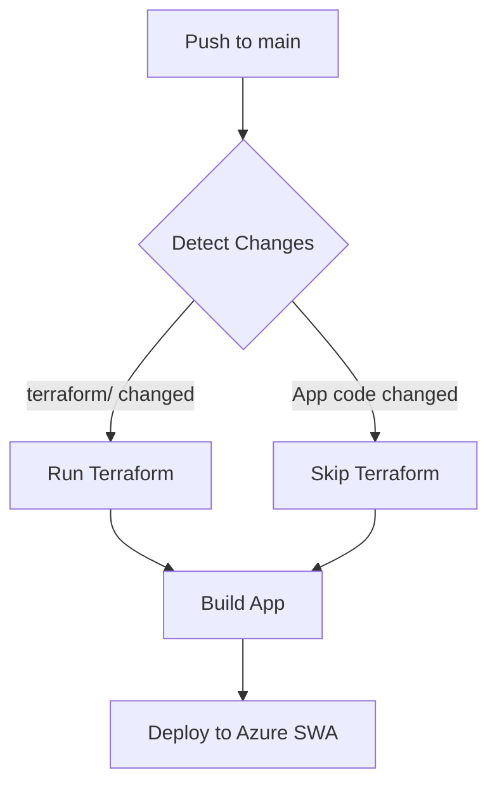

# Azure Static Web App Deployment with Terraform

This guide explains how to deploy the portfolio to Azure Static Web App using Terraform and GitHub Actions.

## 🎯 Key Features

✅ **One-Time Setup** - Automated setup script handles everything
✅ **Smart Deployment** - Terraform only runs when infrastructure changes
✅ **Cost Efficient** - Free tier, no charges for typical portfolio traffic
✅ **Automated CI/CD** - GitHub Actions handles build and deploy
✅ **Secure** - OIDC authentication, no passwords stored

## Prerequisites

1. **Azure Account** with an active subscription
2. **Azure CLI** installed locally ([Download](https://docs.microsoft.com/en-us/cli/azure/install-azure-cli))
3. **Terraform** (v1.6.0 or later) ([Download](https://www.terraform.io/downloads))
4. **GitHub repository** with appropriate permissions
5. **GitHub CLI** (optional, recommended) ([Download](https://cli.github.com/))

## 🚀 Quick Start (Automated Setup)

### Option 1: PowerShell (Windows)

```powershell
# Run the automated setup script
.\scripts\azure-setup.ps1
```

### Option 2: Bash (Linux/Mac)

```bash
# Make script executable
chmod +x scripts/azure-setup.sh

# Run the automated setup script
./scripts/azure-setup.sh
```

The script will:
1. ✅ Login to Azure
2. ✅ Create Azure AD Application and Service Principal
3. ✅ Configure federated credentials for GitHub Actions
4. ✅ Run Terraform to create Static Web App
5. ✅ Optionally set GitHub secrets automatically

**That's it!** After the script completes, you can push to `main` branch to deploy.

---

## 📖 Manual Setup (Alternative)

If you prefer manual setup:

### 1. Create Azure Service Principal with OIDC

Create a service principal for GitHub Actions to authenticate with Azure:

```bash
# Login to Azure
az login

# Set your subscription
az account set --subscription "YOUR_SUBSCRIPTION_ID"

# Create resource group for the app (optional - Terraform will create it)
# az group create --name kishan-portfolio-rg --location westeurope

# Create Azure AD Application
az ad app create --display-name "GitHub-Portfolio-Deploy"

# Get the Application (Client) ID
APP_ID=$(az ad app list --display-name "GitHub-Portfolio-Deploy" --query [].appId -o tsv)

# Create Service Principal
az ad sp create --id $APP_ID

# Get Service Principal Object ID
SP_OBJECT_ID=$(az ad sp list --display-name "GitHub-Portfolio-Deploy" --query [].id -o tsv)

# Get Subscription ID and Tenant ID
SUBSCRIPTION_ID=$(az account show --query id -o tsv)
TENANT_ID=$(az account show --query tenantId -o tsv)

# Assign Contributor role to the Service Principal
az role assignment create \
  --role Contributor \
  --assignee $APP_ID \
  --scope /subscriptions/$SUBSCRIPTION_ID

# Create federated credential for GitHub Actions
az ad app federated-credential create \
  --id $APP_ID \
  --parameters '{
    "name": "GitHubActionsPortfolio",
    "issuer": "https://token.actions.githubusercontent.com",
    "subject": "repo:kishan-vivicta/kishan-portfolio:ref:refs/heads/main",
    "audiences": ["api://AzureADTokenExchange"]
  }'

echo "Client ID: $APP_ID"
echo "Tenant ID: $TENANT_ID"
echo "Subscription ID: $SUBSCRIPTION_ID"
```

### 2. Configure GitHub Secrets

Add the following secrets to your GitHub repository:
- Go to: Settings → Secrets and variables → Actions → New repository secret

| Secret Name | Value | Description |
|-------------|-------|-------------|
| `AZURE_CLIENT_ID` | Output from `$APP_ID` above | Service Principal Application ID |
| `AZURE_TENANT_ID` | Output from `$TENANT_ID` above | Azure AD Tenant ID |
| `AZURE_SUBSCRIPTION_ID` | Output from `$SUBSCRIPTION_ID` above | Azure Subscription ID |
| `AZURE_STATIC_WEB_APP_API_KEY` | From Terraform output | Static Web App deployment token |

---

## 🎯 How It Works

### Smart Terraform Execution

The GitHub Actions workflow uses **path filtering** to run Terraform only when needed:

**Terraform runs when:**
- Files in `terraform/` directory change
- Manually triggered via workflow_dispatch

**Terraform skips when:**
- Only app code changes (`src/`, `public/`, etc.)
- Only documentation changes

**App deployment runs when:**
- Any app code changes
- Terraform creates/updates infrastructure
- Manually triggered

### First Push vs Subsequent Pushes

**First Push (Infrastructure + App):**
1. Detects `terraform/` files
2. Provisions Azure Static Web App
3. Builds React app
4. Deploys to Azure
5. **Duration: ~7-8 minutes**

**Subsequent Pushes (App Only):**
1. Skips Terraform (no infrastructure changes)
2. Builds React app
3. Deploys to Azure using stored API key
4. **Duration: ~3-4 minutes**

**Infrastructure Updates:**
1. Detects changes in `terraform/`
2. Runs Terraform plan and apply
3. Updates Static Web App if needed
4. Builds and deploys app
5. **Duration: ~6-7 minutes**

---

## 🔄 Deployment Workflow



---

## 💡 Usage Examples

### Deploy App Changes Only
```bash
# Make changes to app code
git add src/
git commit -m "Update hero section"
git push origin main
# ✅ Terraform skipped, app deployed in ~3 mins
```

### Update Infrastructure
```bash
# Change region or resource names
git add terraform/variables.tf
git commit -m "Change region to North Europe"
git push origin main
# ✅ Terraform runs, infrastructure updated, app deployed
```

### Manual Trigger
Go to: **Actions → Deploy to Azure Static Web App → Run workflow**
- Forces both Terraform and deployment

---

## 📊 Cost Breakdown

**Free Tier Limits:**
- Bandwidth: 100 GB/month
- Storage: 0.5 GB per app
- Custom Domains: 2 per app
- Staging Environments: 3 per app

**Your Portfolio:**
- App Size: ~5-10 MB ✅
- Expected Traffic: < 10 GB/month ✅
- **Cost: $0.00/month** ✅

---

## 🔧 Terraform Resources Created

```hcl
Resource Group: kishan-portfolio-rg
├── Static Web App: kishan-portfolio-swa
    ├── SKU: Free
    ├── Location: West Europe
    └── URL: https://[random].azurestaticapps.net
```

---

## 3. Test Terraform Locally (Optional)

```bash
# Navigate to terraform directory
cd terraform

# Initialize Terraform
terraform init

# Login to Azure
az login

# Plan the deployment
terraform plan

# Apply the configuration
terraform apply

# Get the Static Web App API key
terraform output -raw static_web_app_api_key
```

### 4. Deploy via GitHub Actions

Once secrets are configured, push to the `main` branch or trigger the workflow manually:

```bash
git add .
git commit -m "Add Azure Static Web App deployment"
git push origin main
```

The workflow will:
1. Provision Azure resources using Terraform
2. Build the React application
3. Deploy to Azure Static Web App

### 5. Access Your Deployed Site

After deployment completes, get the URL:

```bash
cd terraform
terraform output static_web_app_url
```

Or check the workflow output in GitHub Actions.

## Terraform Resources Created

- **Resource Group**: `kishan-portfolio-rg` (West Europe)
- **Static Web App**: `kishan-portfolio-swa` (Free tier)

## Customization

### Change Location or Names

Edit `terraform/variables.tf`:

```hcl
variable "resource_group_name" {
  default = "your-custom-rg-name"
}

variable "location" {
  default = "northeurope"  # or your preferred region
}

variable "static_web_app_name" {
  default = "your-app-name"
}
```

### Upgrade to Standard Tier

Edit `terraform/variables.tf`:

```hcl
variable "sku_tier" {
  default = "Standard"
}

variable "sku_size" {
  default = "Standard"
}
```

## Custom Domain (Optional)

After deployment, add a custom domain:

```bash
az staticwebapp hostname set \
  --name kishan-portfolio-swa \
  --resource-group kishan-portfolio-rg \
  --hostname www.yourdomain.com
```

## Cleanup

To destroy all Azure resources:

```bash
cd terraform
terraform destroy
```

## Troubleshooting

### Authentication Errors
- Verify secrets in GitHub are correct
- Check service principal has Contributor role
- Ensure federated credential subject matches your repo

### Terraform State
- For production, configure remote backend in `main.tf`
- Use Azure Storage Account for state management

### Build Failures
- Check Node.js version compatibility
- Verify `npm run build` works locally
- Review GitHub Actions logs

## Additional Resources

- [Azure Static Web Apps Documentation](https://learn.microsoft.com/en-us/azure/static-web-apps/)
- [Terraform Azure Provider](https://registry.terraform.io/providers/hashicorp/azurerm/latest/docs)
- [GitHub Actions for Azure](https://learn.microsoft.com/en-us/azure/developer/github/github-actions)
